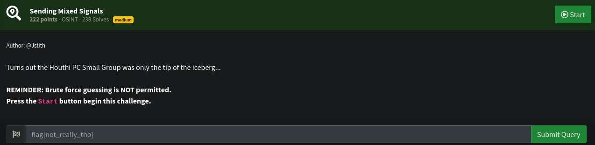
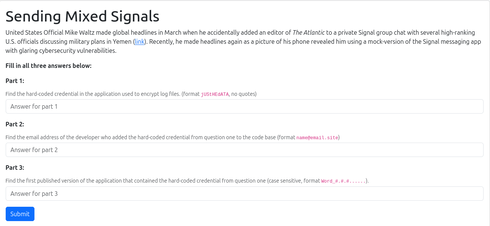
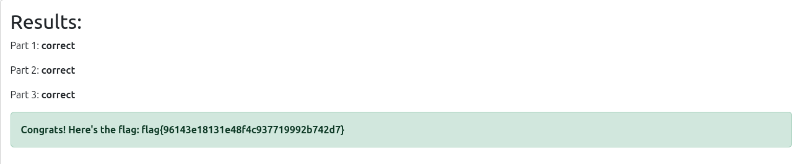

# OSINT Write-up: Nahamsec CTF - Sending Mixed Signals

##  Challenge Adı
**Sending Mixed Signals**

## Soru


### Aşamalar

Challenge URL'si:
```
http://challenge.nahamcon.com:30691/
```

##  Verilen site




---


Challenge, üç parçalı bir veri doğrulama sistemine sahipti:  
- `part1`: Şifre
- `part2`: E-posta adresi
- `part3`: Sürüm bilgisi (Git tag)

---

##  Hardcoded Credential

İlk olarak kaynak kod analizleri ve NVD üzerinden yapılan araştırmalarda sabit bir credential’a ulaşıldı:

```
part1 = "enRR8UVVywXYbFkqU#QDPRkO"
```

Bu bilgi, `ArchiveConstants.kt` dosyasında yer almakta ve CVE-2025-47730 gibi kaynaklarda da doğrulanmış.

## Geliştirici E-Postası

Kod tabanında e-posta adresi olarak şu bilgi bulundu:

```
part2 = "moti@telemessage.com"
```

Bu e-posta, geliştirici **Moti Amar**'a aittir.

---

##  Credential'ın Dahil Olduğu Sürüm

Credential'ın dahil edildiği sürüm şu şekilde tespit edildi. Yazılan python scripti ile brute force saldırısı yapılmıştır:

```
Release_5.4.11.20
```

GitHub repo: [`micahflee/TM-SGNL-Android`](https://github.com/micahflee/TM-SGNL-Android)

Doğrudan commit linki:  
https://github.com/micahflee/TM-SGNL-Android/commit/ddc9f6d5f62e69333d6792f6fd49ac1593ea81bc

---

##  Brute Force Script

Aşağıdaki script ile GitHub üzerinden tüm tag’ler çekilerek deneme yapıldı:

```python
import requests

url = "http://challenge.nahamcon.com:30691/"

part1 = "enRR8UVVywXYbFkqU#QDPRkO"
part2 = "moti@telemessage.com"

owner = "micahflee"
repo = "TM-SGNL-Android"

def get_all_tags():
    tags = []
    page = 1
    while True:
        api_url = f"https://api.github.com/repos/{owner}/{repo}/tags?page={page}&per_page=100"
        resp = requests.get(api_url)
        if resp.status_code != 200:
            print(f"GitHub API error: {resp.status_code}")
            break
        data = resp.json()
        if not data:
            break
        tags.extend([tag['name'] for tag in data])
        page += 1
    return tags

def try_versions(tags):
    for tag in tags:
        version = tag
        if not version.startswith("Release_"):
            version = "Release_" + version

        payload = {
            "part1": part1,
            "part2": part2,
            "part3": version
        }

        print(f"Trying version: {version}")
        r = requests.post(url, data=payload)
        if "incorrect" not in r.text.lower():
            print(f"\n[+] Found valid version: {version}\n")
            return version
    print("\n[-] No valid version found in the tags.")
    return None

if __name__ == "__main__":
    print("[*] Fetching all tags from GitHub repo...")
    tags = get_all_tags()
    print(f"[*] Total tags fetched: {len(tags)}")

    valid_version = try_versions(tags)
```


### Brute Force Sounucu


---


# FLAG



---


## 🔗 Kaynaklar

- [CVE-2025-47730 - GitHub Advisory](https://github.com/advisories/GHSA-9qc4-m2hc-5vc5)
- [Micah Lee Blog Yazısı](https://micahflee.com/heres-the-source-code-for-the-unofficial-signal-app-used-by-trump-officials/)
- [TM-SGNL-Android GitHub Repo](https://github.com/micahflee/TM-SGNL-Android)
