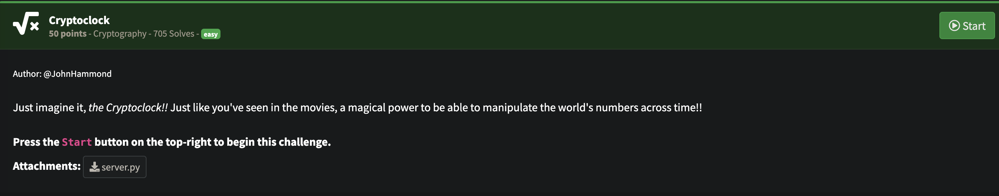
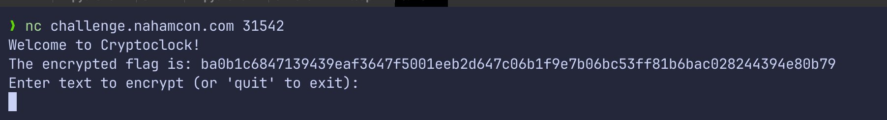

## NahamCon CTF 2025 -Cryptoclock Writeup

### Soru:


### Çözüm:
Soruda verilen python dosyasını incelediğimde, bağlanan kullanıcılara, zaman tabanlı bir key ile XOR şifrelenmiş flag’i verdiğini ve kullanıcının gönderdiği verileri aynı yöntemle şifreleyip geri döndürdüğünü fark ettim. 

Yönlendirildiği gibi sunucuya netcat ile bağlandım;


Bana şifrelenmiş bi flag verdi. Ben de şu scripti kullandım:

``` Python
import time
import random

def encrypt(data: bytes, key: bytes) -> bytes:
    return bytes(a ^ b for a, b in zip(data, key))

def generate_key(length: int, seed: int) -> bytes:
    random.seed(seed)
    return bytes(random.randint(0, 255) for _ in range(length))

encrypted_hex = "a99631cebc76a635c5c36ebb3a430c057500f0ca1dc0d828d35f71e75d92a4bbf130c187407f"
encrypted_bytes = bytes.fromhex(encrypted_hex)

end_time = int(time.time())
start_time = end_time - 24*60*60

for t in range(start_time, end_time):
    key = generate_key(len(encrypted_bytes), t)
    decrypted = encrypt(encrypted_bytes, key)
    
    try:
        decoded = decrypted.decode()
        if all(32 <= ord(c) <= 126 for c in decoded):  # printable ASCII
            print(f"[+] Time: {t}")
            print("[+] Decrypted:", decoded)
            break
    except:
        continue
```

Bu kod, zaman tabanlı bir XOR anahtarıyla şifrelenmiş veriyi çözmek için son 24 saatteki tüm olası zaman damgalarını deneyerek brute-force saldırısı yapar. Her anahtarla deşifre edilen sonucu ASCII karakter aralığında kontrol edip, geçerli bir metin bulduğunda ekrana yazdırır.

### FLAG!!

