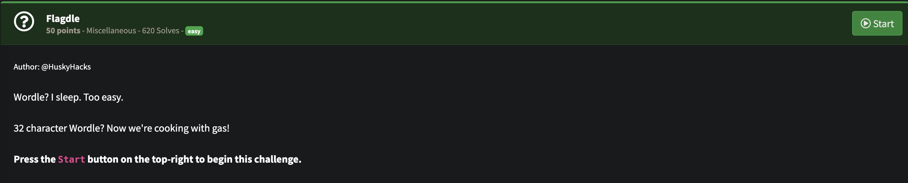
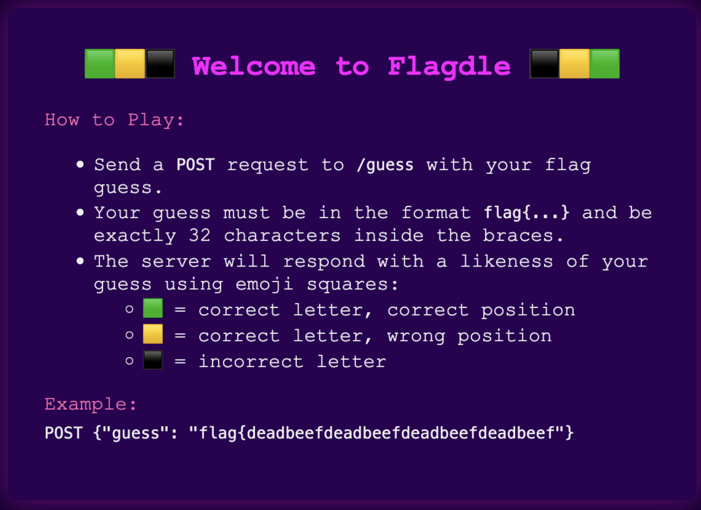
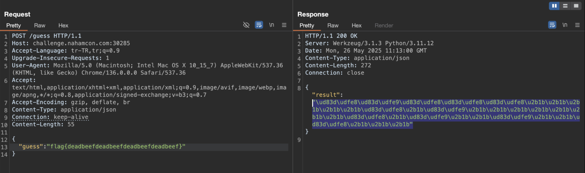
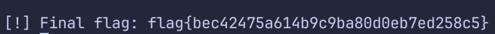

## NahamCon CTF 2025 -Flagdle Writeup

### Soru:


### ÇÖzüm:
Soruya eriştiğimde şu ekranla karşılaştım;


Bu bana çok tanıdık geldi, sıksık wordle çözerim:)

Bana aynen dendiği gibi /guess endpoint'ine Burp Suite üzerinden *POST* isteği attım ama görseldeki örnektejki gibi gönderebilmem için *Content-Type: Application/json* yapmam gerekti.


Bu yüzden bana flag{} içerisindeki karakterleri sırayla deneyip yeşil kutucuk yani \\\ud83d\\\udfe9 dönünce diğer konuma geçen bi script gerekti:

``` Python
import requests
import json

url = "http://challenge.nahamcon.com:30285/guess"
charset = "abcdefghijklmnopqrstuvwxyz0123456789"

flag = ["_"] * 32

def parse_response(response_text):
    return response_text.count("🟩")

for position in range(32):
    for char in charset:
        # Tüm bilinen karakterleri yerleştir, yalnızca bu pozisyondaki karakteri test et
        temp_flag = flag.copy()
        temp_flag[position] = char
        guess = "flag{" + "".join(temp_flag) + "}"

        if len(guess) != 38:
            continue

        payload = {"guess": guess}
        response = requests.post(url, json=payload)

        try:
            result = json.loads(response.text)["result"]
        except Exception as e:
            print(f"[!] Hata: {e} | Yanıt: {response.text}")
            continue

        greens = parse_response(result)

        print(f"Trying: {guess} → {greens}")

        # Eğer doğru sayısı = şu ana kadar bilinen pozisyon sayısı + 1 ise, bu karakter doğru
        known_greens = len([c for c in flag if c != "_"])
        if greens == known_greens + 1:
            flag[position] = char
            print(f"[+] Found char at pos {position}: {char}")
            break

# Final flag gösterimi
final_flag = "flag{" + "".join(flag) + "}"
print(f"\n[!] Final flag: {final_flag}")
````
Ve sonunda...
### FLAG!



