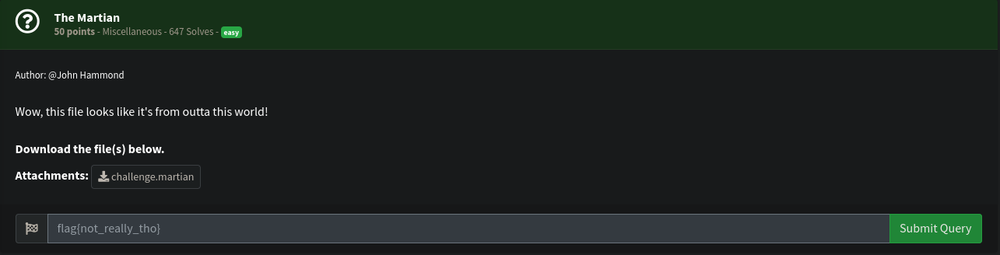
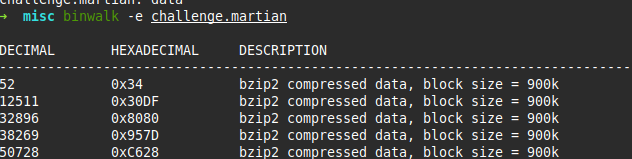
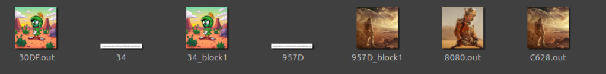
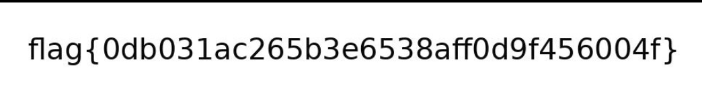

# misc Write-up: Nahamsec CTF - The Martian
##  Challenge Adı
**TheMartian**

## Soru:



### Aşamalar

**ilk başta dosya türüne baktım**
```bash
file challenge.martian
```
challenge.martian: data

**daha sonra bu dosynın içinde başka dosyalar var mı diye bakıp çıkarttım**



 
**sonra _challenge.martian.extracted adlı dosyadan çıkan görselleri inceledim ve flag çıktı**



# FLAG


