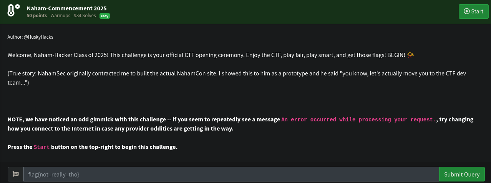
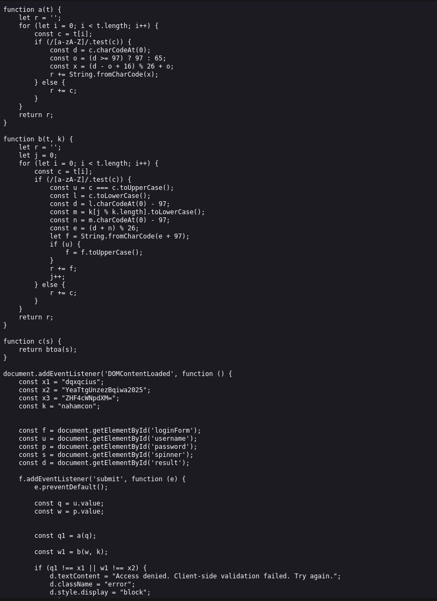
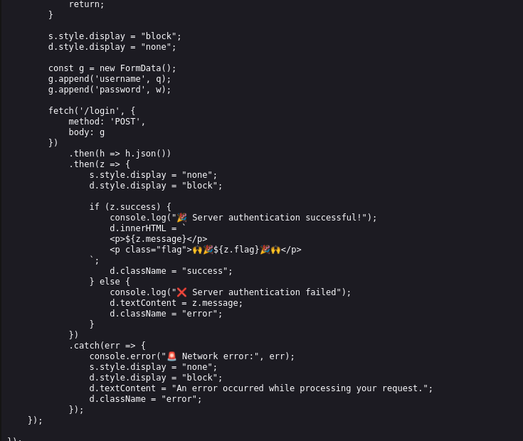
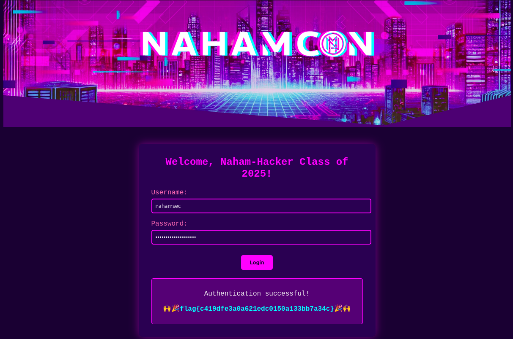

# Warmups Write-up: Nahamsec CTF - Naham Commencement 2025

##  Challenge Adı
**Naham Commencement 2025**

## Soru:



### Aşamalar

Challenge da verilen URL:
```
http://challenge.nahamcon.com:30113
```

Challenge verilen bir web sitesinde kullanıcı bilgilerini bulup login olduktan sonra flagi okuyabilmek

## Kaynak Kodu İncelemesi






a fonksiyonu 16 harflik Caesar Cipher yapıyor

b fonksiyonu bir Vigenère şifrelemesi uygular value ve key değeri alır her iki harfin alfabedeki sırasını bulur toplar sonucu mod 26 ile sınırlar ve çıkan değerin karşılık geldiği harfi alarak şifreleme yapar Harf olmayan karakterler aynen korunur

buna göre tersine çevirip bir kod yazdım ve şifreleri çözdüm 


```
username:nahamsec
password:LetTheGamesBegin2025

```


# FLAG

