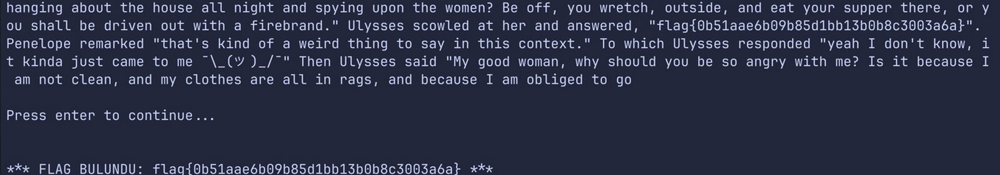

## NahamCon CTF 2025 -The Oddyssey Writeup

### Soru:


### Çözüm:
Soruyu başlattıktan sonra nc ile bağlanmamızı istiyor, bağlandığımızda ise;


Bağlandıktan sonra her enter dediğimizde bi metin çıkıyordu ve muhtemelen flag bu metinlerin içinde bir yerdeydi fakat metinler bitmedi...

Aklıma bi script yazmak geldi, bu script 5 ms de bir enter diyecek ve çıkan metnin içerisinde *flag{* kelimesini aratacak:

``` python
import socket
import time
import select

host = 'challenge.nahamcon.com'
port = 30186

s = socket.socket()
s.connect((host, port))
s.setblocking(0)

try:
    time.sleep(2)
    s.sendall(b'\n')

    while True:
        ready = select.select([s], [], [], 10)
        if ready[0]:
            data = s.recv(4096)
            if not data:
                print("Sunucu bağlantıyı kapattı.")
                break
            decoded = data.decode(errors='ignore')
            print(decoded)
            if 'flag{' in decoded:
                start = decoded.find('flag{')
                end = decoded.find('}', start) + 1
                print(f"\n*** FLAG BULUNDU: {decoded[start:end]} ***")
                break
            time.sleep(0.5)
            s.sendall(b'\n')
        else:
            print("10 saniyede veri gelmedi, tekrar dene")
finally:
    s.close()
```

Kısa süreli bekleyişten sonra flag geldi:

### FLAG!

