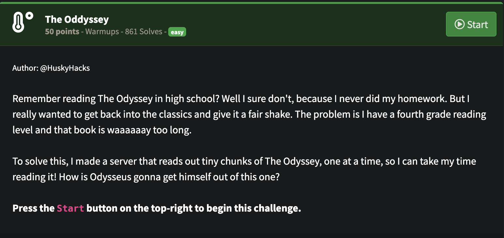

## NahamCon CTF 2025 -The Oddyssey Writeup

### Soru:

### Çözüm:
Soruyu başlattıktan sonra nc ile bağlanmamızı istiyor, bağlandığımızda ise;

Bağlandıktan sonra her enter dediğimizde bi metin çıkıyordu ve muhtemelen flag bu metinlerin içinde bir yerdeydi fakat metinler bitmedi...

Aklıma bi script yazmak geldi, bu script 5 ms de bir enter diyecek ve çıkan metni bi output dosyasına yazacak, sonra bu dosyanın içinde flag aratacağız:

