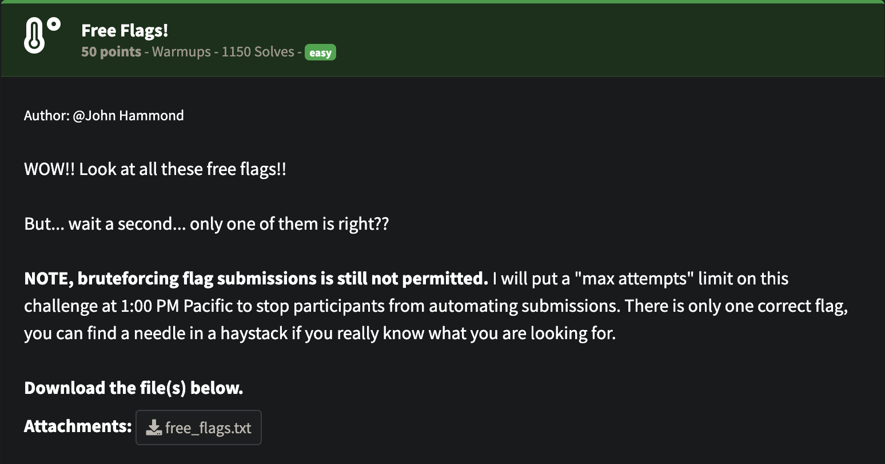
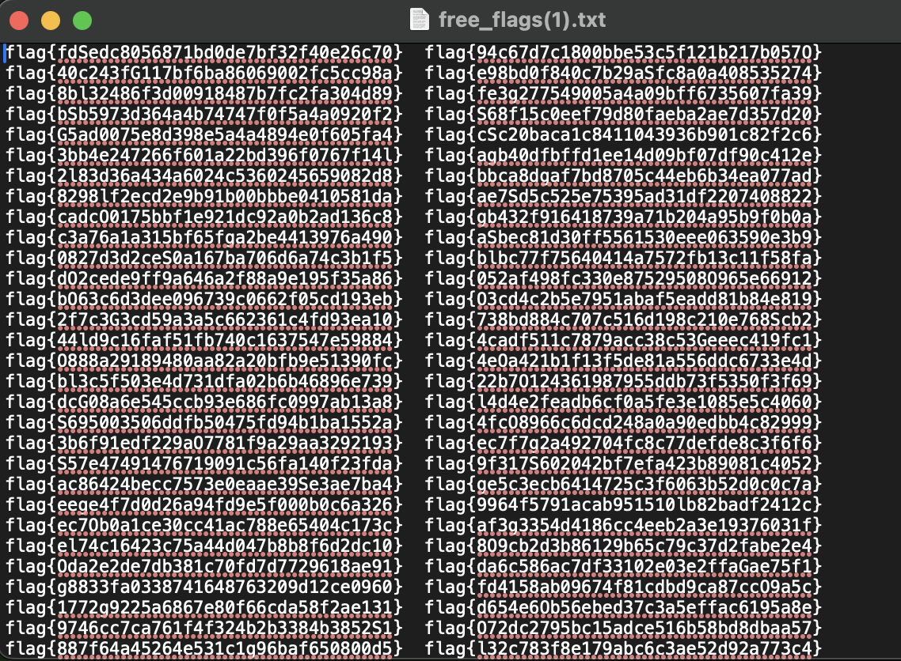
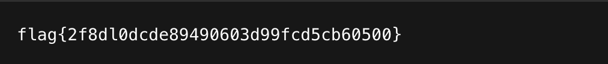

## NahamCon CTF 2025 - Free Flags! Writeup

### Soru:


### Çözüm:
Bize free_flags.txt adında bi dosya verilmiş ve oldukça fazla flag var. Hangisinin doğru flag olduğunu bulmak için ufak bi göz gezdirdim ve fark ettim ki bazıları birden fazla kez kullanılmış. Burada aklıma eşsiz flagi bulma fikri geldi.

Şimdi bu dosyada yalnızca bir kez geçen flagi bulalım;



Bunun için şu scripti kullandım:

```from collections import Counter
import re

with open("free_flags.txt", "r") as file:
    content = file.read()

flags = re.findall(r"flag\{[a-zA-Z0-9]+\}", content)

counts = Counter(flags)

unique_flags = [flag for flag, count in counts.items() if count == 1]

print(unique_flags)
````

### FLAG!🏁

