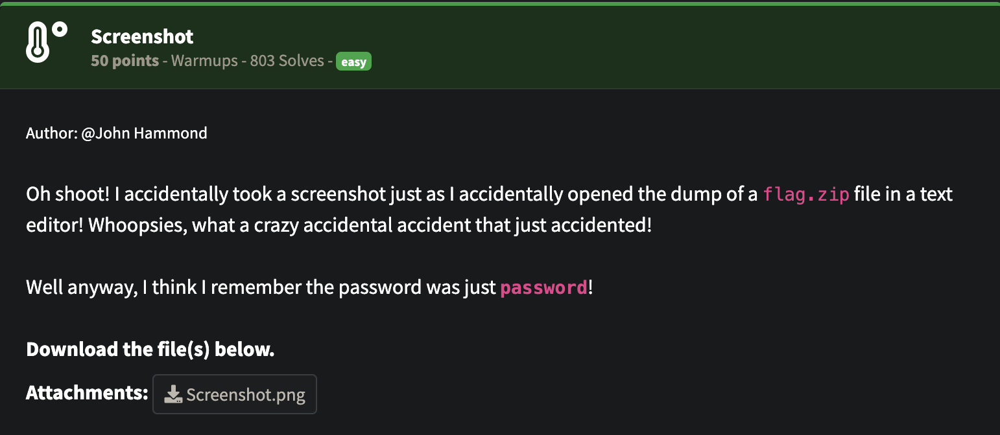
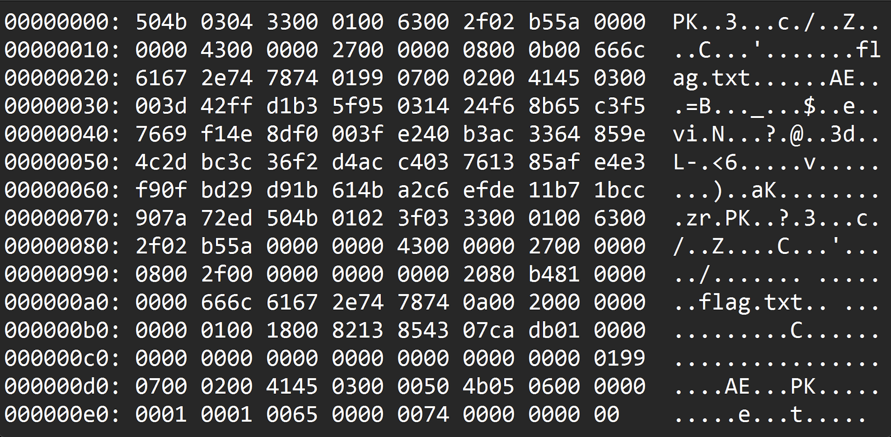
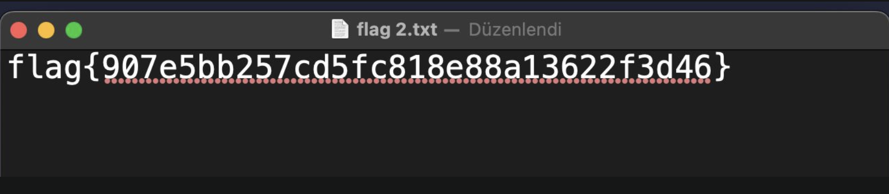

## NahamCon CTF 2025 -  Screenshot Writeup

### Soru:


### Çözüm:
Bir .zip dosyasının (flag.zip) hex dökümünü içeren bir ekran görüntüsü verilmiş bunun için Hex Dump ZIP Recovery yapacağız



Verileri manuel veya OCR (Tesseract) ile çıkardıktan sonra Python ile şu adımları izledik

```from binascii import unhexlify

hex_data = "<temizlenmiş hex string>"
binary = unhexlify(hex_data)

with open("flag.zip", "wb") as f:
    f.write(binary)
```
Bu sayede flag.zip dosyasını oluşturduk.

Soruda zip dosyasının parolası "password" olarak verilmiş. Bunu kullanarak zipi açıyoruz... 

### FLAG!🎉

