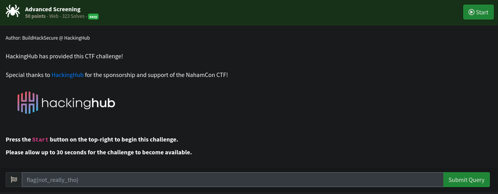

# WEB Write-up: Nahamsec CTF - Advanced Screening

##  Challenge Adı
**Advanced Screening**

## Soru:



### Aşamalar

Challenge da verilen URL:
```
http://challenge.nahamcon.com:30331
```

**Verilen linke gittim kaynak kodunu açtım /assets/js/app.js dosyasından kodu okudugumda /api/screen-token endpointini ve /screen/?key=${tokenData.hash} endpointini gördüm**


**daha sonra /api/screen-token endpointinde user_id parametresine ilk 10 id'yi girdim ve 7. id üzerinde bana tokenı verdi**


daha sonra /screen/?key=fe49e2554d481e070c213ec0b8a9113e gittigimde flagi aldım

# FLAG

