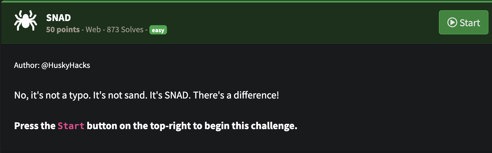
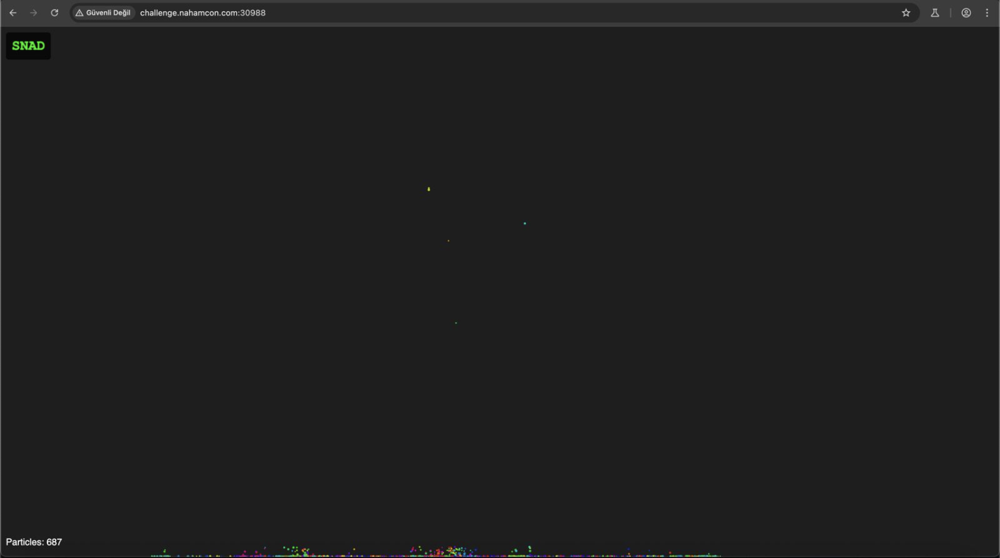
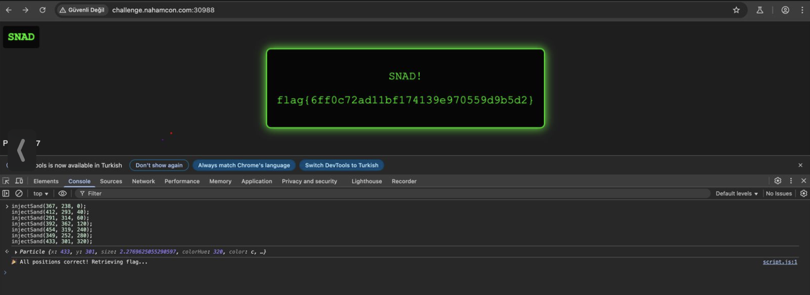

## NahamCon CTF 2025 -SNAD Writeup

### Soru:


### Çözüm:
Makineyi başlattıktan sonra verilen linke gittim ve karşıma bu arayüz çıktı. 



Burada ekrana tıkladığımda renkli kum tanecikleri düşüyordu. Başta anlam veremedim ama sonradan kaynak kodu incelediğimde /js/script yolunu keşfettim ve hemen gittim;


Bunu incelediğimde amacın, farklı renkteki kum tanelerini (particles) belirli koordinatlara ve renk tonlarına göre doğru şekilde yerleştirerek flag'i elde etmek olduğunu anladım.

### Görev:

injectSand(x, y, hue) fonksiyonu ile 7 tane kum tanesini (particle) doğru x, y, hue ile hedef konumlara yerleştirmek.

Bu hedefler targetPositions dizisinde verilmiş:

```bash
const targetPositions = [
  { x: 367, y: 238, colorHue: 0 },
  { x: 412, y: 293, colorHue: 40 },
  { x: 291, y: 314, colorHue: 60 },
  { x: 392, y: 362, colorHue: 120 },
  { x: 454, y: 319, colorHue: 240 },
  { x: 349, y: 252, colorHue: 280 },
  { x: 433, y: 301, colorHue: 320 }
];
```

Demek ki tarayıcı konsolunda aşağıdaki kodu çalıştırırsam sonuç gelecek:

```bash
injectSand(367, 238, 0);
injectSand(412, 293, 40);
injectSand(291, 314, 60);
injectSand(392, 362, 120);
injectSand(454, 319, 240);
injectSand(349, 252, 280);
injectSand(433, 301, 320);
```
### FLAG!!🥳

